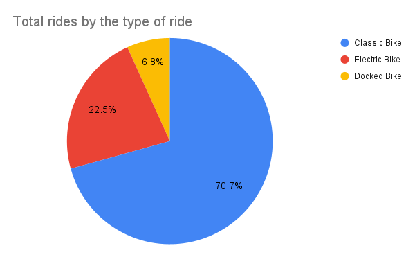

# bike-share-data-analysis
Bike share data analysis case study. Follows the steps of the data analysis process: ask, prepare, process, analyze, share, and act.

**Case Study: How does a bike-share navigate speedy success?**

# Introduction:

This case study as a part of my Google Data Analytics Certificate capstone project is my take on utilizing my technical and analytical skills I learned in my entire course(from ask phase to prepare, process,analyze,share and act using different tools and platforms such as spreadsheets, SQL, tableau,R etc.) to perform a business task  and develop necessary insights for the data driven decision making. The case study involves analysis of historical data for a company named  Cyclistic, a bike sharing company located in Chicago, to design a new marketing strategy to study how casual and member riders behave differently and what we can do to convert casual riders into annual members.


# Scenario:

In 2016, Cyclistic launched a successful bike-share offering. Since then, the program has grown to a fleet of 5,824 bicycles that are geotracked and locked into a network of 692 stations across Chicago. The bikes can be unlocked from one station and returned to any other station in the system anytime. Until now, Cyclistic’s marketing strategy relied on building general awareness and appealing to broad consumer segments. One approach that helped make these things possible was the flexibility of its pricing plans: single-ride passes, full-day passes, and annual memberships. Customers who purchase single-ride or full-day passes are referred to as casual riders. Customers who purchase annual memberships are Cyclistic members.

Cyclistic’s finance analysts have concluded that annual members are much more profitable than casual riders. Although the pricing flexibility helps Cyclistic attract more customers, therefore the  team wants to convert cyclist members into annual members. 

The analyst team wants to know how annual members and casual riders differ, why casual riders would buy a membership, and how Cyclistic can use digital media to influence casual riders to become members. The team is interested in analyzing the Cyclistic historical bike trip data to identify trends and patterns in the usage of bikes by casual and member riders.


# Approach:

So with the introduction of the project and the actual scenario of the case stated above, I am the junior data analyst analyzing this task for the bike sharing company- cyclist. 

For this case study, I am asking the six phases of data analytics process:


* Ask: Asking the right question 
* Prepare: Collecting and using the data relevant to the business problem
* Process: Process the data to find out errors, inconsistencies, null values etc. in data and get rid of them so that the ineffectiveness in data doesn’t affect the business task and the insights we are going to develop from it.
* Analyze: Find and develop the trend, relationship and patterns in data that helps us solve our business task effectively.
* Share: Create visualizations of our analysis and information to share it with stakeholders and others
* Act: Provide recommendations to stakeholders on how to solve the business task and make informed decisions.


## Phase I: Ask

**Business Objective**:  Increasing future growth of the company by converting cyclist members into annual members via marketing campaigns

**Business Task**: How do annual members and casual riders use Cyclistic bikes differently?

**Stakeholders**: The stakeholders in the projects are:


* Lily Moreno: The director of marketing who is responsible for the development of campaigns and initiatives to promote the bike-share program. 
* Cyclistic marketing analytics team: A team of data analysts who are responsible for collecting, analyzing, and reporting data that helps guide Cyclistic marketing strategy.
* Cyclistic executive team: The executive team will decide whether to approve the recommended marketing program.


## Phase II: Prepare

**Where is the date located?**

The [data](https://divvy-tripdata.s3.amazonaws.com/index.html) that I will be using for this project is provided and licensed by Motivate International Inc. 

**How is the data organized?**

Yearly data regarding this matter is provided and licensed by Motivate International Inc but for my analysis I am using the most recent data i.e. the last 5 months data of 2020. The data is organized in csv files monthly and these monthly csv files are stored in year wise directories so that it is easy to access. Each csv file consists of data stored in rows and columns, it contains 13 columns as ride_id, rideable_type, started_at, ended_at, start_station_name, start_station_id, end_station_name, end_station_id, longitudinal datas and so on. 

**How does it help you answer your question?**

The last column in the csv file i.e. member_casual gives information on if the riders with respective id’s are member or casual riders. This information can be helpful on further analysis as it helps in understanding on what way the casual and member riders use bike sharing differently which is our key business task as well.

**Are there any problems with the data?**

There is no detailed information about the riders. The rider id being the only identification element, the same person may have been a rider with two or more different ids. Therefore I assume that each user id is a different user.

**Are there issues with bias or credibility in this data? Does your data ROCCC?**

The [data](https://divvy-tripdata.s3.amazonaws.com/index.html)  is collected directly by Motivate, Inc., the company that runs the Cyclistic Bike Share program for the City of Chicago. The data is comprehensive in that it consists of data for all the rides taken on the system. Also, the data is collected and updated monthly and yearly. Hence the date provided is reliable, original, comprehensive, current and is cited and be used for our analysis.

**How are you addressing licensing, privacy, security, and accessibility?**

The  data-privacy issues prohibit using riders’ personally identifiable information. Also this data is licensed by Motivate International Inc as well.

**How did you verify the data’s integrity?**

The data being provided by the proper source ensures the data's integrity.


## Phase III: Process

For this project, I've used a year trip-data datasets i.e. 12 datasets dated from Jan 2021 to Dec 2021. I am using Postgresql to help process, clean and analyze my datasets. Firstly I imported all the .csv files of trip data from Jan 2021 to Dec 2021 to my database server. I verified the number of columns and datatype in each dataset to be the same and merged them together in a new table that I created. And then I created a table using all the column names with their respective data types as stated by the original dataset.

**Creating a new table in postgresql to store all the columns and values from 12 month separate csv files:**


```
CREATE TABLE rider_data.rider_data2021
(
    ride_id varchar(255),
rideable_type varchar(30),
started_at timestamp,
ended_at timestamp,
start_station_name varchar(100),
start_station_id varchar(50),
end_station_name varchar(100),
end_station_id varchar(50),
start_lat float,
start_lng float,
end_lat float,
end_lng float,
member_casual varchar(50)
)
```


 And I imported all the csv files into the same table that I created. I used the count function each time to make sure the number of rows imported are as per the original file. 

Total of 5595063 rows are inserted into the table.

**Cleaning and Analyzing Data:**

Now I am analyzing the data to remove any null values, empty values, duplications, adding new columns with reference to datas from existing columns to get better insights on business tasks.

I created a new column ride_length to calculate the trip duration i.e total time from ride started to ride ended. For this I used the ALTER TABLE function to add a new column to the table and I used Extract function with epoch FROM to calculate the time difference between two timestamps in minutes. I also created new columns start_month and day_of_week to store the month and day values from the provided timestamps.

**Creating new column “ride_length” to calculate trip duration as the difference of started_at and ended_at column:**


```
ALTER TABLE rider_data.rider_data2021
ADD ride_length float;

UPDATE rider_data.rider_data2021
SET ride_length = ROUND(Extract(epoch FROM (ended_at - started_at)/60), 2)
```


Then I deleted the rows with null or empty values in order to get accurate analysis, validate and make sure the dataset does not include any bias, incorrect data, and duplicates.1006761 such rows were deleted. Then I deleted the rows with ride_length equals to zero or less than zero or more than 1440 minutes for data accuracy. 

1473 such rows were deleted.

**Deleting rows with null, inaccurate and duplicate values:**


```
DELETE 
FROM rider_data.rider_data2021
WHERE ride_length = 0 OR
ride_length < 0 OR
ride_length > 1440
```


Then I used the COUNT and DISTINCT function to look for any duplications in the ride_id. Both total count and distinct count returned 4586829 rows which means there are no any duplications in the ride_id.

**Checking if there’s any duplication in rider id in ride_id column:**


```
SELECT 
COUNT(ride_id) AS Total_id,
COUNT(DISTINCT ride_id) AS Uniq_id
FROM rider_data.rider_data2021

```


## Phase IV Analyze:

I have combined both the analyze and share phase in this same section here since both go side by side. The tools I have used for data visualizing and sharing insights are postgresql, google sheets, tableau public and R studio.


### Counting riders by the type of rider:

Our dataset and the project scenario tells us that we have two types of riders- casual riders and member riders. For visualization about the type of rider, I firstly used the COUNT function in sql to count the total number of casual riders and member riders to see how they differ in number. 

**Counting number of casual and member riders:**


```
SELECT 
member_casual AS member_type,
COUNT(*) AS total_number
FROM rider_data.rider_data2021
WHERE member_casual = 'member'
GROUP BY member_type
UNION
SELECT 
member_casual AS member_type,
COUNT(*) AS total_number
FROM rider_data.rider_data2021
WHERE member_casual = 'casual'
GROUP BY member_type
```


 This query returned the number of casual riders as 2047043 and number of member riders as 2539786 in the year 2021. To create visualization for this data I used “R”- downloaded the “tidyverse” package and used ggplot and geom functions to create a pie chart which shows that 55.5% of the riders are member riders and the remaining 44.6% are casual riders.

**Creating pie chart visualization in R:**


```
# Installing required packages
install.packages("tidyverse")

#Loading ggplot2
library(ggplot2)

# Importing csv file into R using read_csv and the file directory
ridertype_count <-read_csv("/Users/user2/Desktop/projects/coursera data analytics/capstone project/queries/exports/membertpe_count.csv")

# Using ggplot and geom functions to create a pie chart
ggplot(ridertype_count, aes(x = "", y = total_number, fill = member_type))+ 
  geom_col()+
  coord_polar(theta = "y")+
  geom_text(aes(label = paste(round(total_number/ sum(total_number) * 100, 1), "%")),
            position = position_stack(vjust = 0.5))+
  theme_void()+
  labs(title = "Overall rider count")+
  labs(fill = "Rider type")+
  theme(plot.title = element_text(vjust = -3))
```                 


        
        Figure 1: Overall rider count by type of rider


#### Counting rideable types by the type of ride:

With the provided datasets, we have a column rideable_type which indicates that both the rider types have three riding options for the bike- classic bike, electric bike and docked bike. I used sql to find the total number of rides by each particular type of ride and used google sheet to create a visualization.


```
SELECT
COUNT (CASE WHEN rideable_type = 'classic_bike' THEN 1 ELSE NULL END) AS classicbike_ride,
COUNT (CASE WHEN rideable_type = 'electric_bike' THEN 1 ELSE NULL END) AS electricbike_ride,
COUNT (CASE WHEN rideable_type = 'docked_bike' THEN 1 ELSE NULL END) AS dockedbike_ride,
COUNT (*) AS totalbike_ride
FROM rider_data.rider_data2021
```



        
        Figure 2: Total rides by the type of ride 

The above pie chart created in google sheets clearly states that among the three ride types offered by the cyclist company, classic bike with 70.7% of total rides is the most popular one and docked bike with 6.8% of total rides is the least popular one.


### Monthly and weekly user traffic:

I then studied  the month wise  data of riders to observe the trend in ridership throughout the year 2021. For this I firstly extracted the month from the given timestamps in data with the column started_at. I added two new columns as start_month and day_of_week to calculate respective months and day of weeks from the provided timestamp to observe weekly and monthly traffic. I used the postgresql in-built function to_char to extract month and day names from timestamps.


```
-- Adding start_month column 
ALTER TABLE rider_data.rider_data2021
ADD start_month varchar 


--Using to_char function to get month name from the timestamps of started_at column
UPDATE rider_data.rider_data2021
SET start_month = TRIM (TO_CHAR (started_at, 'Month'))

-- Adding day_of_week column
ALTER TABLE rider_data.rider_data2021
ADD day_of_week varchar

--Using to_char function to get day name from the timestamps of started_at column
UPDATE rider_data.rider_data2021
SET day_of_week = TRIM (TO_CHAR (started_at, 'Day'))
```


Then with these columns, I can now extract information to visualize monthly and weekly ridership patterns of both the casual and member rider type to gain what insight those data offers to help us solve our business task on how casual and member riders differ on their ride usage patterns.I then used the following query in postgresql to calculate monthly rides by the type of riders.

**Calculating rides by rider type and month of a year:**


```
WITH temp_member AS (
SELECT
CASE WHEN member_casual = 'member' THEN 'member' ELSE 'casual' END AS member_type,
COUNT (CASE WHEN member_casual = 'member' THEN 1 ELSE NULL END) AS num_of_members,
COUNT (CASE WHEN member_casual = 'casual' THEN 1 ELSE NULL END) AS num_of_casuals,
start_month
FROM rider_data.rider_data2021
GROUP BY start_month, member_casual 
ORDER BY EXTRACT(MONTH FROM TO_DATE(start_month, 'Month'))
) 
SELECT member_type,
CASE WHEN num_of_members =0 THEN num_of_casuals ELSE num_of_members END AS member_count,
start_month
FROM temp_member;
  
    
```


I used R studio to create a visualization showing the monthly ridership patterns of both the casual and rider members. To create visualization in R, I firstly imported the csv file into R studio using read_csv and then with the use of ggplot2 from "tidyverse" package, I created the bar chart to study monthly ride patterns of both the rider types.

```
# Importing csv file into R using read_csv and storing it as ridecount_month
ridecount_month <-read_csv("/Users/user2/Desktop/projects/coursera data analytics/capstone project/queries/exports/ridecount_month.csv")

#Viewing the file
View(ridecount_month)

# Creating grouped bar graph using geom and ggplot functions  
ggplot(ridecount_month, aes(x = fct_inorder(start_month), y = format(member_count, scientific = FALSE),fill=member_type))+
  geom_bar(stat = 'identity', position = position_dodge())+
  labs(title = "Categorized rides by month")+
  xlab("Months")+
  ylab("No. of rides")+
  labs(fill = "Rider Type")
  
```


                 
        Figure 3: Casual vs member ride use throughout the month

The  tableau visualization with a side by side bar chart categorizing monthly ridership by rider type depicts that for both casual and member riders, _ridership peaked around July and hit the lowest at February_ before rebounding up sharply. Also, July and August seem to have received more casual riders than the member riders indicating that July and August can be an ideal month to do any marketing campaigns or programs to convert casual riders into member riders. The observations of ridership trends throughout the year indicate a seasonal pattern in cyclistic bike usage. It is more common for both members and casual riders to choose to ride in the summer months, when the weather is nice and the days are long and avoiding it in the cold winter and snowy months.

**Calculating rides by rider type and day of a week:**

The query below is used to calculate the weekly traffic of ridership of both rider types. 

WITH temp_member AS (
SELECT day_of_week,
CASE WHEN member_casual = 'member' THEN 'member' ELSE 'casual' END AS member_type,
COUNT (CASE WHEN member_casual = 'member' THEN 1 ELSE NULL END) AS num_of_members,
COUNT (CASE WHEN member_casual = 'casual' THEN 1 ELSE NULL END) AS num_of_casuals
FROM rider_data.rider_data2021
GROUP BY day_of_week, member_casual 
ORDER BY CASE
          WHEN day_of_week = 'Monday' THEN 0
          WHEN day_of_week = 'Tuesday' THEN 1
          WHEN day_of_week = 'Wednesday' THEN 2
          WHEN day_of_week = 'Thursday' THEN 3
          WHEN day_of_week = 'Friday' THEN 4
          WHEN day_of_week = 'Saturday' THEN 5
          WHEN day_of_week = 'Sunday' THEN 6
     END ASC
) 
SELECT member_type,
CASE WHEN num_of_members =0 THEN num_of_casuals ELSE num_of_members END AS member_count,
day_of_week
FROM temp_member;


Further to find out day of week having highest ridership, I created another tableau visualization  which shows that the trend of ridership for member riders is consistent throughout the week with a bit drop on Sunday but for casual riders, week day bike trips are significantly lower compared to member rides and peaking on weekend i.e. Saturday and Sunday.


                 
        Figure 4: Casual vs member ride use throughout the day of a week

These usage patterns might indicate that rider members tend to use bikes on a daily basis as part of their work with their rides being consistent through the week days and a bit lower than other days on weekends whereas casual riders may be more interested in using bikes for recreational purposes with peak ride on weekend days. 

In addition, casual riders tend to spend more time on average bike riding than the  member riders, also suggesting that members use bikes primarily for point-to-point transportation constantly throughout the week for the same purpose and less for leisure or exploration.


**Average Ride Length on day of week by member type:**
To calculate average ride length on a day of week by member typr, I used two methods in postgresql with the first method being using an in-built filter in the average function in postgresql and another method being using a clause to filter member_casual columns and using inner join to join two queries.

```
-- First method using filter in average function    
SELECT
AVG(ride_length) FILTER (WHERE member_casual = 'member') AS avg_ride_member,
AVG(ride_length) FILTER (WHERE member_casual = 'casual') AS avg_ride_casual,
day_of_week
FROM rider_data.rider_data2021
GROUP BY day_of_week
ORDER BY CASE 
     WHEN day_of_week = 'Monday' THEN 0
     WHEN day_of_week = 'Tuesday' THEN 1
     WHEN day_of_week = 'Wednesday' THEN 2
     WHEN day_of_week = 'Thursday' THEN 3
     WHEN day_of_week = 'Friday' THEN 4
     WHEN day_of_week = 'Saturday' THEN 5
     WHEN day_of_week = 'Sunday' THEN 6
     END ASC


-- Second method using having clause to filter and using inner join to join two tables
SELECT avg_ride_member, avg_ride_casual, a.day_of_week from
    (SELECT
    AVG(ride_length)AS avg_ride_member,
    day_of_week
    FROM rider_data.rider_data2021
    GROUP BY day_of_week, member_casual
    HAVING member_casual = 'casual') a
JOIN
    (SELECT
    AVG(ride_length)AS avg_ride_casual,
    day_of_week
    FROM rider_data.rider_data2021
    GROUP BY  member_casual, day_of_week
    HAVING member_casual = 'member') b
ON a.day_of_week = b.day_of_week
ORDER BY CASE
      WHEN a.day_of_week = 'Monday' THEN 0
          WHEN a.day_of_week = 'Tuesday' THEN 1
          WHEN a.day_of_week = 'Wednesday' THEN 2
          WHEN a.day_of_week = 'Thursday' THEN 3
          WHEN a.day_of_week = 'Friday' THEN 4
          WHEN a.day_of_week = 'Saturday' THEN 5
          WHEN a.day_of_week = 'Sunday' THEN 6
          END ASC

```


Also the visualization below shows the average trip duration taken by both the type of riders each day a week.


                 
        Figure 5: Casual vs member average ride length throughout the day of a week

The above chart created in tableau shows that the average trip taken by a casual rider is about 28 minutes, whereas the average trip taken by a member rider is about 13 minutes meaning around half the average trip duration of casual rider.

**Hourly traffic analysis:**

For hourly analysis of rides, I first created a new column "hour" to the existing table with data type integer (int) to store hour values. Then I used postgresql in-built function "extract" to extract hour from the timestamps in started_at column.
```
ALTER TABLE rider_data.rider_data2021
ADD hour_day int

UPDATE  rider_data.rider_data2021
SET hour_day = EXTRACT (HOUR from started_at)
```
Then I used a query in postgresql to find out number of riders (casual vs member) by hour of the day.

```
WITH temp_table AS(
SELECT hour_day, member_casual,
COUNT (CASE WHEN member_casual = 'member' THEN 1 ELSE NULL END) AS num_of_members,
COUNT (CASE WHEN member_casual = 'casual' THEN 1 ELSE NULL END) AS num_of_casuals,
COUNT(*) AS num_of_users
FROM rider_data.rider_data2021
GROUP BY hour_day, member_casual)
SELECT member_casual, 
CASE WHEN num_of_members = 0 THEN num_of_casuals ELSE num_of_members END AS member_count,
hour_day
FROM temp_table
```

With the data from above query, I then created a visualization in R to study hourly traffic of both the rider types- casual and member riders.

```
# Importing the csv file into R
hour_day <-read_csv("/Users/user2/Desktop/projects/coursera data analytics/capstone project/queries/exports/hour_day.csv")

# Viewing the file
View(hour_day)

#Loading ggplot2 from "tideyverse" package
library(ggplot2)

# Using ggplot and geom functions to create a area chart)
ggplot(hour_day, aes(x = hour_day, y =member_count, fill = member_type ))+
  geom_area()+
  scale_y_continuous(labels = scales::comma)+
  scale_x_discrete(limits = 1:23)+
  xlab("Hour of day in 24 hours")+
  ylab("No. of rides")+
  labs(title = "Categorized rides by hour of the day")+
  labs(fill = "Rider type")
 
```

The visualization below shows that both rider types use the ride mostly in the evening time and casual rider use ride significantly more than the member riders.


                 
        Figure 6: Casual vs member hourly ride

**Geo Data Analysis**

For geo data analysis I used the columns with latitude and longitude values for start and end station name for both riders which helped me point out the most popular stations and how the riders are distributed throughtout the area. I use tableau to create geo data visualization. F


                 
    Figure 7: Arrival and departure distribution (Casual riders)

The above map shows the geographical distributions of casual member throughout the area. The map shows that they are mostly centered by the sea side and around the touristic spots. Further I used filter in tableau to filter the station names by trips per station, the differences in the size of dots indicates bigger the size more the members in that station and vice-versa. I created individual departure and arrival sheets in tableau public and added both of them to a new dashboard to make a interactive visualization. These dot sizes, changes in color of dots are done by the elements in tableau mark card such as color, size, detail etc. Further adding size, color to the number of members and start station name to detail in mark card helps us to get information on particular dot while hovering on it.
Further using the filter in tableau, I have filtered out top 5 most popular arrival sttaions of casual riders.


                 
    Figure 8: Top 5 most popular arrival stations (Casual Riders)

The geo data analysis of member rider is as follows:


   Figure 9: Arrival and departure distribution (Member riders)

 The geo data visualization for member riders in tableau using the same way as above shows that these riders are distributed through both the touristic side and office buildings side as well. The most popular departure stations of member riders are as follows:


   Figure 10: Top 5 most popular departure stations (Member Riders)


## Phase V: Share Insights

Now in this phase we’re ready to use these insights to make recommendations for the marketing team.

**Rider Type**: The data suggests that there are clearly more member riders than the causal riders but not significantly much hence the company has a lot to do in marketing campaigns to be able to convert those casual riders into member riders as well.

**Ride type**: The data suggests that classic bikes are the most preferred bike type and docked bikes are the lowest preferred bike type among both types of riders. The data suggested that in a year time docked bikes have been used only once by the member rider.

**Usage time**:   Average ride length is constant for member riders throughout the year while for casual riders it peaks on weekend days which further justifies the above mentioned point as well.
Based on this finding, marketing team can create some ad campaigns such as offering some bonus rides for longer rides to attract casual riders.

**Use cases**: It can be inferred that casual riders are more likely to use their bikes for longer periods of time than the member riders- may be member riders use it only for short ride transit from train stations to offices and home only and casual riders use it for sightseeing around and other entertainment purposes. Casual riders are more likely to use rides on weekends and member riders on weekdays- may be member riders use this for home to office purposes and casuals for entertainment and sightseeing around as well.
Based on this finding, it’s worth considering to offer new types of membership focused on weekend rides and family membership (families tend to spend their weekends together) to casual riders so that we can convert them into member riders.

**Seasoning**: The ridership pattern for both the casual and member rider type peaked during July and it started dropping from August and dropped to lowest in February. This pattern might have something to do with the seasonal changes stating that the ridership peaked during summer time with nice weather and long days and dropped significantly in the winter time because of cold and snow. The cyclist number started rising from february with peaking in july and started dropping from august with least in february.
Based on this insight, July can be ideal time to do marketing campaigns and events to convert casual riders into member riders.

 
## References:
https://www.coursera.org/professional-certificates/google-data-analytics?

https://www.postgresql.org/docs/

https://public.tableau.com/app/profile/pram2230#!/

https://ggplot2.tidyverse.org/

https://help.tableau.com/current/pro/desktop/en-us/gettingstarted_overview.htm


